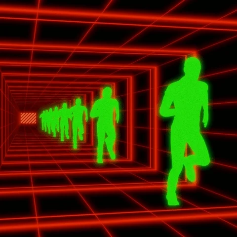

## Eai Tudo bem? 👋

Sou Estudante de Engenharia de software no Unisenai , e Hoje estou atuando como aprendiz em Cybersistemas na Bosch!😁❤

- 👩‍💻 Preferencia em back-end

  &nbsp;
  &nbsp;
  &nbsp;
  &nbsp;
  &nbsp;
  
  

---

